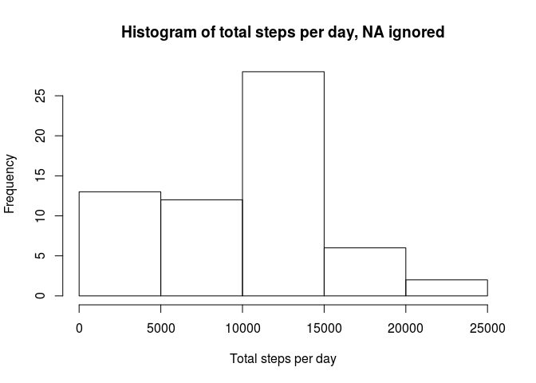
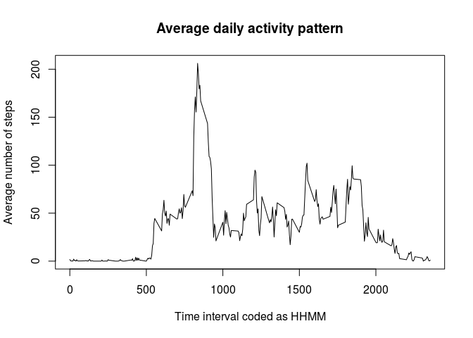
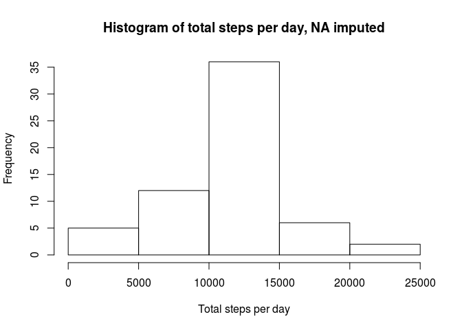
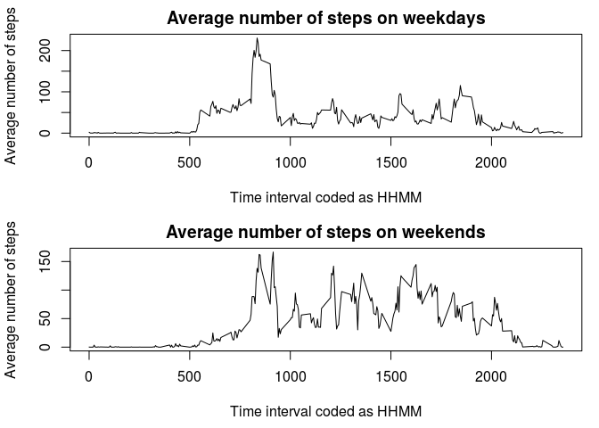

# Reproducible Research: Peer Assessment 1

## Loading and preprocessing the data

To start the analyis, the data is loaded:

```r
activity_data<-read.csv(unzip("activity.zip","activity.csv"), header=TRUE)
```

## What is mean total number of steps taken per day?

The following histogram shows the total number of steps taken each day, NA values 
are ignored:

```r
activity_per_day<-tapply(activity_data$steps,activity_data$date,FUN=sum,na.rm=TRUE)
hist(activity_per_day, xlab="Total steps per day", main="Histogram of total steps per day, NA ignored")
```

<!-- -->

The mean of the total number of steps per day is:    

```r
mean(activity_per_day)
```

```
## [1] 9354.23
```
The median of the total number of steps per day is:

```r
median(activity_per_day)
```

```
## [1] 10395
```
 
## What is the average daily activity pattern?
The following time series plot shows the average number of steps taken in each of 
the 5-minute intervals of a day, NA values are ignored:

```r
activity_per_interval<-tapply(activity_data$steps,activity_data$interval,FUN=mean,na.rm=TRUE)
plot(as.integer(names(activity_per_interval)),activity_per_interval, type="l", 
     xlab="Time interval coded as HHMM", ylab="Average number of steps", 
     main="Average daily activity pattern")
```

<!-- -->

The intervals are coded as HHMM, leading "0" are omitted, e.g. "0" stands for 
midnight, "500"" stands for 5 o'clock in the morning,...

The maximum number of steps, averaged over all days, is contained in the following
5-minute interval:

```r
activity_per_interval[activity_per_interval==max(activity_per_interval)]
```

```
##      835 
## 206.1698
```
The answer shows that the maximum are about 206 steps in the time interval at
8.35.

## Imputing missing values

The steps column of the data set contains 2304 NA values, that is about 13%:

```r
sum(is.na(activity_data$steps))
```

```
## [1] 2304
```

```r
mean(is.na(activity_data$steps))
```

```
## [1] 0.1311475
```

The other columns are completely filled with values:

```r
sum(is.na(activity_data$date))
```

```
## [1] 0
```

```r
sum(is.na(activity_data$interval))
```

```
## [1] 0
```

As a strategy for filling in missing values I use the mean value of the particular 
5-minute interval. With this strategy a new data set is created:

```r
activity_filled<-activity_data
activity_filled <- within(activity_filled, steps <- ifelse(is.na(steps), activity_per_interval[names(activity_per_interval=="test$interval")], steps))
```

With the imputed data, the histogram from above looks like this:

```r
activity_filled_day<-tapply(activity_filled$steps,activity_filled$date,FUN=sum,na.rm=TRUE)
hist(activity_filled_day, xlab="Total steps per day", main="Histogram of total steps per day, NA imputed")
```

<!-- -->

The mean and median of the total number of steps per day with the imputed data are:    

```r
mean(activity_filled_day)
```

```
## [1] 10766.19
```

```r
median(activity_filled_day)
```

```
## [1] 10766.19
```

With the imputed data the histogram now looks a lot more like a normal distribution.
Both mean and median of the total number of steps are larger now than before which 
was expected since more non-negative data was added. With the imputed data, mean
and median are equal now. Before there was a difference of about a 1000 steps,
pointing out that the data was not symmetrically distributed.

## Are there differences in activity patterns between weekdays and weekends?

To answer this question a new variable is added which contains the factors
"weekday" and "weekend". With the help of these new factors, the data set is split
into one for weekdays and one for weekends and the average number of steps during
each 5-minute interval is calculated for both data sets:

```r
library(dplyr)
```

```
## 
## Attaching package: 'dplyr'
```

```
## The following objects are masked from 'package:stats':
## 
##     filter, lag
```

```
## The following objects are masked from 'package:base':
## 
##     intersect, setdiff, setequal, union
```

```r
# "Samstag" is german for "Saturday", "Sonntag" is german for "Sunday"
activity_filled <- mutate(activity_filled, weekday=ifelse(weekdays(as.Date(activity_filled$date)) %in% c("Samstag","Sonntag"), "weekend","weekday"))

activity_weekday<-activity_filled[activity_filled$weekday=="weekday",]
activity_per_interval_wd<-tapply(activity_weekday$steps,activity_weekday$interval,FUN=mean,na.rm=TRUE)

activity_weekend<-activity_filled[activity_filled$weekday=="weekend",]
activity_per_interval_we<-tapply(activity_weekend$steps,activity_weekend$interval,FUN=mean,na.rm=TRUE)
```

The differences in activity on weekdays and weekends is shown in the following time series:


```r
par(mfrow=c(2,1), mar=c(4.5,4.1,2,1))
plot(names(activity_per_interval_wd), activity_per_interval_wd, type="l", xlab="Time interval coded as HHMM", ylab="Average number of steps", main="Average number of steps on weekdays")
plot(names(activity_per_interval_we), activity_per_interval_we, type="l", xlab="Time interval coded as HHMM", ylab="Average number of steps", main="Average number of steps on weekends")
```

<!-- -->
  
  
  
  
